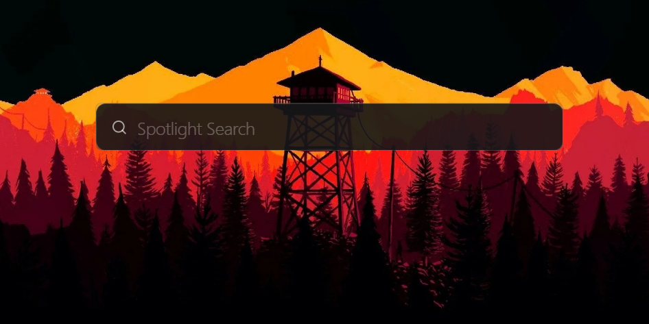
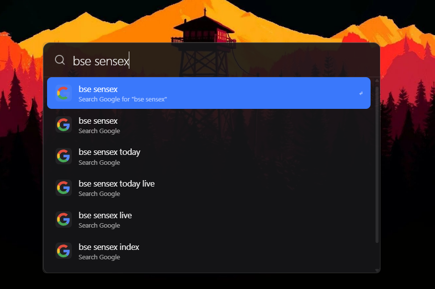
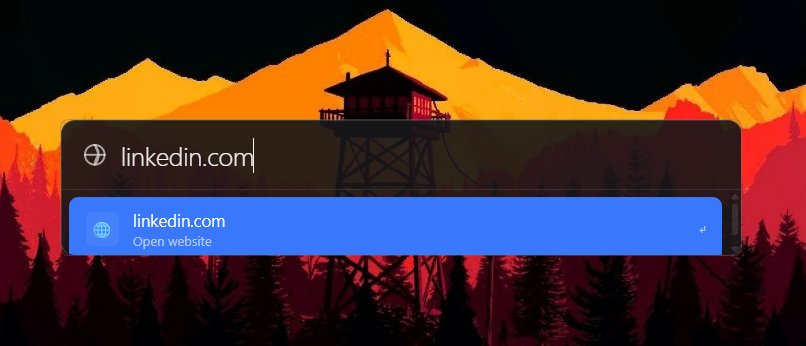
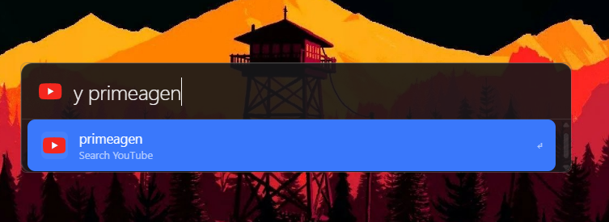
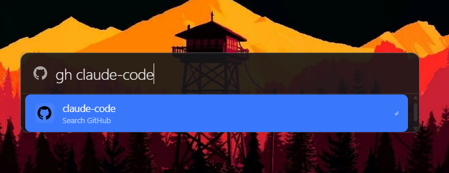

# Spotlight Web

A minimal, fast, web-based tool effectively bringing a **macOS-like Spotlight search experience to Windows**, built with Tauri.

## Super Fast & Efficient

Designed for speed. Use global shortcuts to toggle instantly without losing your context.

### Key Shortcuts
-   **`Alt + Space`**: Open / Minimize (Saves your current search progress).
-   **`Esc`**: Minimize immediately.

## Features

-   **Bang Patterns**: `g` (Google), `y` (YouTube), `gh` (GitHub).
-   **Smart URL Detection**: Automatically detects and opens URLs.
-   **Google Auto-Suggest**: Real-time search suggestions.
-   **Keyboard Navigation**: Full keyboard control (Arrows, Enter, Tab, Esc).
-   **Draggable UI**: Click and drag anywhere (except interactive elements) to move the window.

## Demo

| Home | Normal Search |
| :---: | :---: |
|  |  |

| Google Search | YouTube Search |
| :---: | :---: |
|  |  |

| GitHub Search |
| :---: |
|  |

## Why build this?

Firing quick queries on macOS is extremely convenient, and I wanted to bring that same efficiency to Windows because I am lazy and love the speed of Spotlight.

## Why only YouTube, GitHub, and Google as Bangs?

I am lazy again and spend ~95% of time on YouTube and random browsing

## Installation

To install **Spotlight Web** on Windows:

1.  Go to the [Releases](https://github.com/Ashwin-1709/spotlight-web/releases) page (if hosted on GitHub).
2.  Download the latest `Spotlight Web_x.x.x_x64-setup.exe` or `.msi` file.
3.  Run the installer and follow the prompts.
4.  Once installed, you can launch it from your Start menu.

## Development

If you want to run the project locally or contribute:

### Prerequisites
- [Node.js](https://nodejs.org/) (v18+)
- [Rust](https://www.rust-lang.org/tools/install)
- [Tauri Prerequisites](https://tauri.app/v1/guides/getting-started/prerequisites)

### Steps
1. Clone the repository.
2. Install dependencies: `npm install`.
3. Run in development mode: `npm run tauri dev`.
4. Build for production: `npm run tauri build`.
